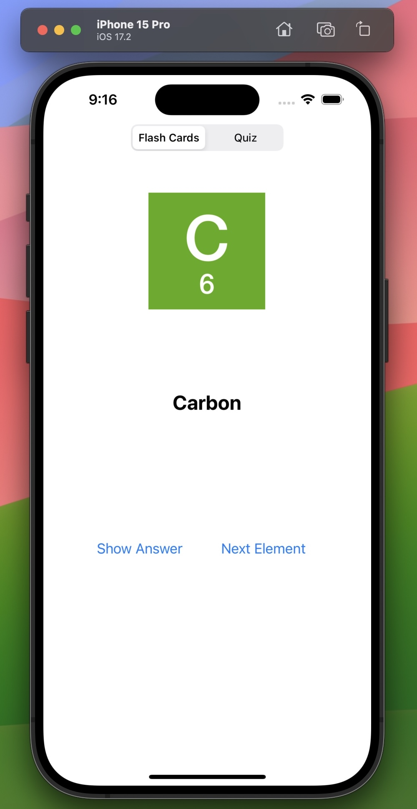

# Element Quiz App

This app is a flash card–style interface. The user will see the element symbol and atomic weight, and can tap a button to reveal the name of the element. It also has a quiz mode, enabling the user to input the correct element name and to receive a score at the end.

## Element Quiz App's Interface

